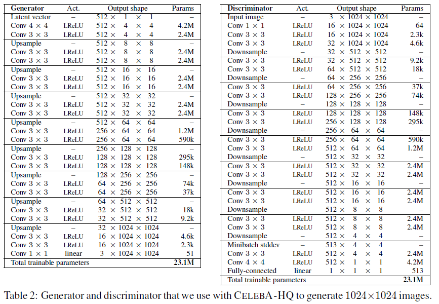
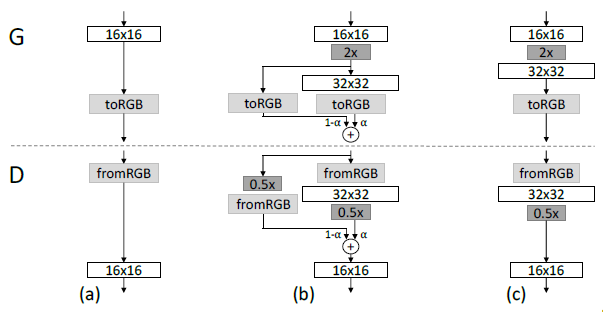
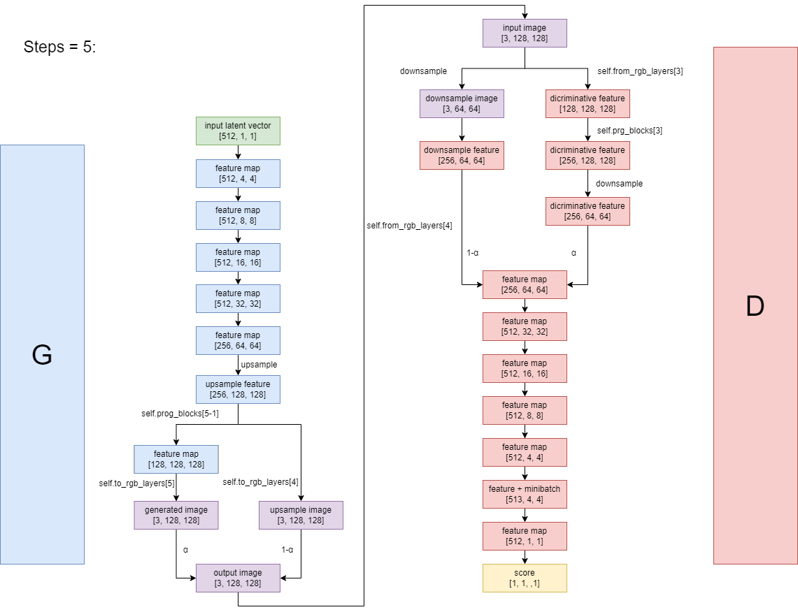

### Pixel Normalization

$$
b_{x,y}=\frac{a_{x,y}}{\sqrt{\frac{1}{N}\sum_{j=0}^{N-1}(a_{x, y}^j)^2+\epsilon}}
$$

where $N$ is the number of channels, and $a_{x, y}$ represents the original feature vector in pixel $(x, y)$. $a_{x, y}^j$ represents the $j\text{th}$ channel value of the feature vector. 

### Final Architecture

​	In the main part of the Generator and the Discriminator, the layers consist of an Upsample layer and 2 Conv layers or 2 Conv layers and a Downsample layer. According to the original paper of ProGAN, all the Conv layers should be Weighted and Scaled. So in the implementation, we define a `WSConv2d` class and a `ConvBlock` class which contains 2 `WSConv2d` layers.

### Fade In Logic

​	When we move to a higher resolution, we need to first upscale the current features by nearest neighbor filtering, and then pass the feature map into the new layers. However, to smooth the process, we add a fading procedure where we use both the upscaled feature and the newly computed features with a controlling factor $\alpha$, in general, this stabilizes the final generated images.

​	Mind that this procedure is only used in the final layer before we use `toRGB` and `fromRGB` layers, which means that the `fade_in` module should be introduced at the end of the Generator and at the beginning of the Discriminator.

### case with final image size at 128*128

| Generator | prog_blocks(channels change) | to_rgb_layers(channels change) |    image size    |
| :-------: | :--------------------------: | :----------------------------: | :--------------: |
|     0     |     $512\rightarrow512$      |       $512\rightarrow3$        | $4\times4$ |
|     1     |     $512\rightarrow512$      |       $512\rightarrow3$        |  $8\times8$  |
|     2     |     $512\rightarrow512$      |       $512\rightarrow3$        |  $16\times16$  |
|     3     |     $512\rightarrow256$      | $512\rightarrow3$ |  $32\times32$  |
|     4     |     $256\rightarrow128$      | $256\rightarrow3$ |   $64\times64$   |
|     5     |      $128\rightarrow64$      | $128\rightarrow3$ |   $128\times128$   |
|     6     |      $64\rightarrow322$      | $64\rightarrow3$ |   $256\times256$   |
|     7     |      $32\rightarrow16$       | $32\rightarrow3$ |    $512\times512$    |
|     8     |                              |       $16\rightarrow3$       |    $1024\times1024$    |

| Discriminator | prog_blocks(channels change) | from_rgb_layers(channels change) | image size |
| :-----------: | :--------------------------: | :------------------------------: | :--------: |
|       0       |  $16\rightarrow32$  |             $3\rightarrow16$             | $1024\times1024$ |
|       1       |  $32\rightarrow64$  | $3\rightarrow32$ | $512\times512$ |
|       2       | $64\rightarrow128$  | $3\rightarrow64$ | $256\times256$ |
|       3       | $128\rightarrow256$ | $3\rightarrow128$ | $128\times128$ |
|       4       | $256\rightarrow512$ | $3\rightarrow256$ | $64\times64$ |
|       5       | $512\rightarrow512$ | $3\rightarrow512$ | $32\times32$ |
|       6       | $512\rightarrow512$ | $3\rightarrow512$ | $16\times16$ |
|       7       | $512\rightarrow512$ | $3\rightarrow512$ | $8\times8$ |
|       8       |                              | $3\rightarrow512$ | $4\times4$ |

